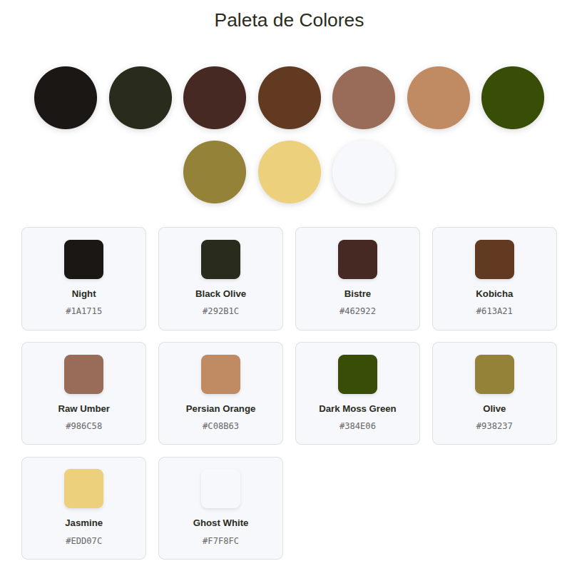
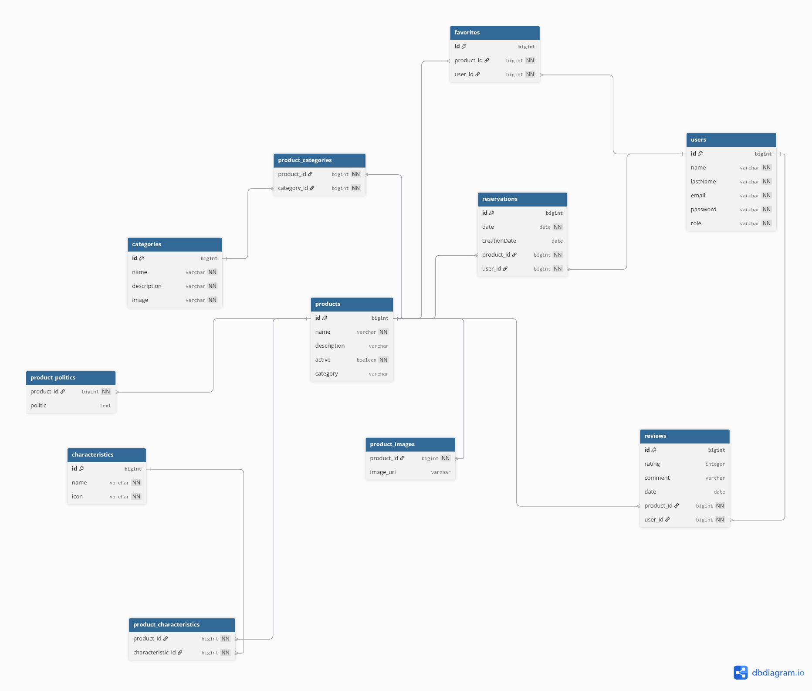

# 🍽️ RÚSTICA — Sistema de Reservas

Rústica es un restaurant especial, no solo ofrece platos de calidad gourmet, sino toda una experiencia.
Cada uno de nuestros productos incluye un menú temático especialmente diseñado para la ocasión; vajilla y mobiliario,
iluminación y musicalización, específicamente seleccionadas para realzar la experiencia y estimular al máximo los sentidos.

---

## 🎨 Paleta de colores



---

## 🏷️ Logo de la marca


---

## ⚙️ Tecnologías

### 🖥️ Frontend

| Tecnología | Versión |
|---|---|
| Vite | 7.1.7 |
| React | 19.1.1 |
| React Router DOM | 7.9.6 |
| Axios | 1.13.2 |
| Bootstrap Icons | 1.13.1 |
| React Datepicker | 9.1.0 |
| React Slick + Slick Carousel | 0.31.0 / 1.8.1 |
| React WhatsApp Widget | 2.2.0 |

### ☕ Backend

| Tecnología | Versión |
|---|---|
| Java | 17 |
| Spring Boot | 3.5.6 |
| Spring Web | — |
| Spring Data JPA | — |
| Spring Security | — |
| Spring Validation | — |
| Spring Mail | — |
| H2 Database | runtime |
| JJWT | 0.11.5 |
| Lombok | — |

---

## 🚀 Instalación local

### 🧩 Requisitos previos

- Node.js 18+
- Java 17+

### 📦 Cloná el repositorio
```bash
git clone https://github.com/Federico-Pedro/DPPF-Federico-Pedro.git
cd DPPF-Federico-Pedro
```

### 📁 Backend (`/backend`)
```bash
cd backend
```

#### Configurar variables de entorno:
```bash
touch .env
```

#### Archivo `.env`:
```dotenv
# JWT
JWT_SECRET=clave_supersecreta

# Mail
MAIL_USERNAME=tucuenta@gmail.com
MAIL_PASSWORD=tu_password
```

#### Correr el backend:
```bash
./mvnw spring-boot:run
```

> El backend estará disponible en `http://localhost:8080`

---

### 🖼️ Frontend (`/frontend`)
```bash
cd frontend
npm install
```

#### Correr el frontend:
```bash
npm run dev
```

> La aplicación estará disponible en `http://localhost:5173`

---

## 📬 Endpoints (API REST)

| Método | Endpoint | Descripción | Auth |
|--------|----------|-------------|------|
| POST | /api/auth/register | Registro de usuario | ❌ |
| POST | /api/auth/login | Login y generación de JWT | ❌ |
| GET | /api/reservas | Listado de reservas del usuario | ✅ |
| POST | /api/reservas | Crear una reserva | ✅ |
| DELETE | /api/reservas/{id} | Cancelar una reserva | ✅ |

> 📌 Completar con los endpoints reales del proyecto

---

## 🗂️ Diagrama de entidades (ER)



---

## 📋 Gestión del proyecto

🔗 [Tablero Trello](https://trello.com/b/mNOHFcSS/desafio-profesional-professional-developer)

---

## 👤 Autor

- [@FedericoPedro](https://github.com/Federico-Pedro)

---

## 📞 Soporte

¿Encontraste un bug o tenés una sugerencia?

- 🐛 [Reportar un bug](#)
- 💡 [Solicitar una feature](#)
- 📧 Email: federicopedroroveda@gmail.com